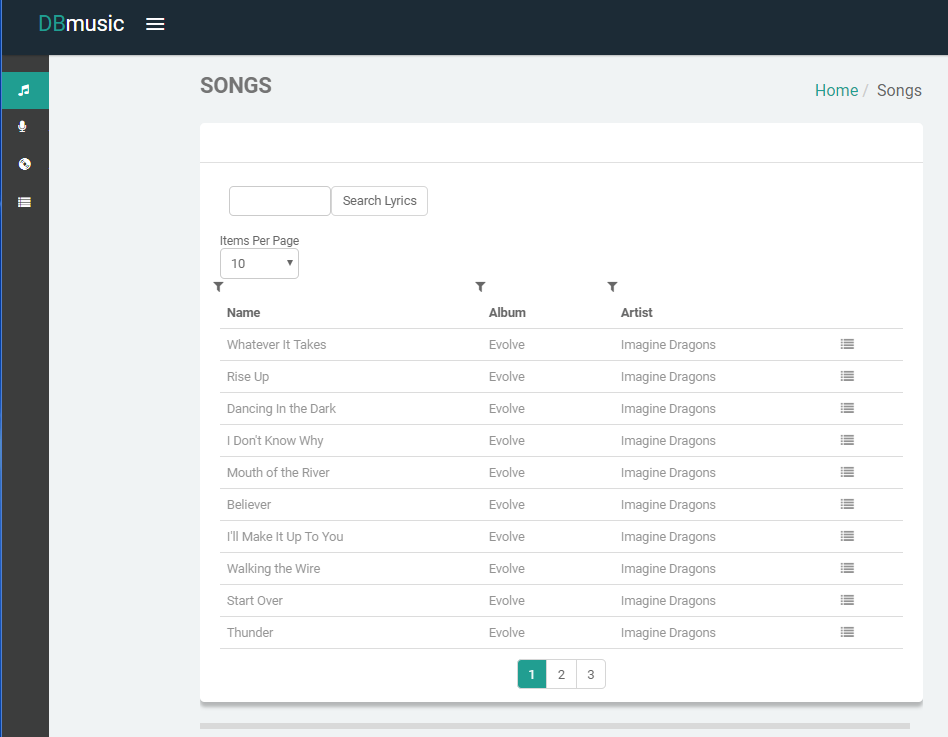

# User Manual

## Personal Playlist Database App
This web application lets registered users to browse and filter through a large database of songs, artists and albums.
- The user may filter a large list of songs based on:
	- Song name.
	- Artist name.
	- Album name.
	- Lyrics. The user may search for a sub-string of the lyrics in the songs, i.e all the songs that contain "database project in them" (there aren't any...)
- The user may filter a large list of albums based on:
	- Artist name.
	- Number of tracks in the album.
- The user may filter a large list of artists based on:
	- Artist name.
	- Total number of songs by the artist (that exist in our database).

After browsing through the database, The user may add songs to a playlist of his.
The user may create as many playlists as he likes, and add or remove songs from it.
Then the user may filter his own playlist as a personal songs database of his playlist.

## Username and password
Currently in the database there are 3 registered users that may be used if you do not wish to create a user.
- User name: user1
- Password: user1_pass

You may create your own user by supplying a desired username and password.

## The Screens Of the Application
- The login screen. user will get here when first entering the site and has the option to log into an existing account by filling his credentials.

- The Sign Up screen. From the login screen the user may want to create a new account. To do so simply press the Sign Up button and then fill in new credentials.

- The songs screen:
	- When logging in (the above image), On left part of the screen there is a music note. Pressing on it  bring you to the songs screen:
	- On the top of the table on the left you may choose how many items you wish to display per page.
	- By pressing any one of the filter symbols, one may choose which filter to filter on (you may choose more than one)
	- In addition to the filtering, user may add a search in all the songs' lyrics, by using the Search Lyrics button.
	
	
	
	- If user wishes to display lyrics of a song, simply press on it in the songs screen:
	
	
	
	- On the right of each song there is a button. If user presses the button, a new window will offer to add the song to a user playlist. This will open a pop up:
	- User may add to a new playlist by providing a name on the left of the Add To New Playlist button.
		
	
		
	- User may add to an existing playlist of his by using the auto-complete functionality in the Select Option box, Then pressing the playlist you wish to add the song to:
		
	

- The artists page:
	- Pressing the microphone icon under the music note will get you to the albums page.
	- Functionality of this page is identical to the songs page (different fields).
	
	

- The albums page:
	- Pressing the CD icon under the microphone icon will get you to the albums page.
	- Functionality of this page is identical to the previous two pages (different fields).
	
	

- The playlists page:
	- Pressing the "hamburger" icon under the CD icon will get you to your personal playlists database page.
	- This page will display all the playlists that belong to the particular user.
	- The user may filter his playlists in a similar manner to all the previous filtering functionality.
	- The user may remove a playlist from his list by pressing the little 'X' symbol on the left.
	
	
	
	- From here the user may choose which playlist to view by pressing on it.
	- From the EXPANDED PLAYLIST VIEW page the user may delete a song from that particular playlist by pressing on the 'X' symbol on the left. 
	
	

## DB updates
Database updates may occur on several occasions:
- In the login screen, if a new user signs up, this will update the Users table by inserting a new entry with the user's credentials and a new unique ID (invisible to user). The password is stored in plaintext instead of a hash since this is a databases course and not an information security coarse.
- When user adds a song to a playlist from the songs page, a new entry in the Playlists table is inserted with the song.
- When user removes a song from when displaying one of his playlists, the entry in the Playlist table will be removed.
- When user removes a playlist, from the playlists page, all the entries with the user's id and the playlist name will be deleted from the Playlists table and the playlist will no longer be available on the playlists page.

## Creating the database (one time only, already done, no need to rerun will take a couple hours)
- First you must execute the CREATE-DB-SCRIPT.sql script this will remove all the previous tables and rebuild them.
- Then, cd into the directory with the python script that populates the DB: `cd SRC/API-DATA-RETRIVAL`
- Populate the database: `python populate_db.py`
- This will take a couple hours since a very large database is built from 2 different external sites.

## Running the app
- cd into the source directory: `cd SRC/APPLICATION-SOURCE-CODE`
- Configure app_config/config.py according to the credentials of the MySQL server you are using (just configure "user" and "pass"). It is currently configured to run on NOVA.
- From the configuration you may also configure the webserver ip. DO NOT CHANGE the port from 4000 since the client uses it.
- If this is the first time running the app, create the users database: `python create_users_db.py`
- Run the server: `python app.py`
- Open your browser to http://localhost:4000/
- Now you may browse the app.
